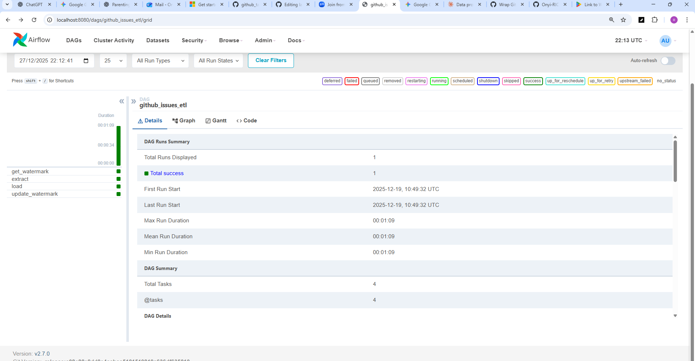

# GitHub Issues ETL Pipeline (Apache Airflow)

🚀 **Production-grade data engineering pipeline built with Apache Airflow, Docker, and PostgreSQL**

This project demonstrates how to design, debug, and operate a real-world ETL system that ingests GitHub repository and issue event data incrementally and reliably.

**Key Skills Demonstrated**
- Apache Airflow DAG design
- Incremental & idempotent ETL
- Dockerized orchestration
- API data modeling
- Production debugging & observability
- Cloud-ready architecture (MWAA / Kubernetes)

🔗 **Tech Stack:** Python · Airflow · Docker · PostgreSQL · GitHub API

---

## TL;DR – How to Run This Project

```bash
git clone https://github.com/Onyi-RICH/github-issues-airflow-etl
cd github-issues-airflow-etl
docker compose up --build

---
## Table of Contents

1. [Project Overview](#1-project-overview)
2. [Mental Model 🧠](#2-mental-model-)
3. [Architecture Overview](#3-architecture-overview)
4. [File Structure](#4-file-structure)
5. [Core Concepts & Acronyms (Student‑Friendly)](#5-core-concepts--acronyms-studentfriendly)
6. [Airflow DAG Design (OOP‑Style)](#6-airflow-dag-design-oopstyle)
7. [Incremental Issue & Repository Extraction Strategy](#7-incremental-issue--repository-extraction-strategy)
8. [Authentication & Secrets](#8-authentication--secrets-)
9. [Database Schema & Deliverables](#9-database-schema--deliverables)
10. [Indexing Strategy (B‑Tree)](#10-indexing-strategy-btree)
11. [Data Cleaning Rules](#11-data-cleaning-rules)
12. [Observability, SLA & Alerts](#12-observability-sla--alerts)
13. [Docker ↔ Airflow Execution Guide](#13-docker--airflow-execution-guide)
14. [Kubernetes / MWAA Readiness](#14-kubernetes--mwaa-readiness)
15. [Challenges & Solutions](#15-challenges--solutions)
16. [Practical Tips](#16-practical-tips)
17. [Recommendations](#17-recommendations)
18. [Summary](#18-summary)

---

## 1. Project Overview

### Task

**Wrap GitHub Issues Extraction Script Into an Airflow DAG**

### Description

A Python ETL pipeline extracts **GitHub repositories and issue‑level event data** (issues, comments, timeline events), transforms it into a **row‑per‑event** analytical table, and loads it into PostgreSQL. The workflow is orchestrated end‑to‑end by **Apache Airflow running in Docker**.

### Objectives

* Automate GitHub data ingestion on a schedule
* No hard‑coded secrets (tokens rotate!)
* Idempotent & safe re‑runs
* Clear task separation & reproducibility
* Production‑ready Airflow design
* Cloud‑ready (Kubernetes / AWS MWAA)

### Who This Project Is For

This project is designed for:
- Data Engineers learning **real Apache Airflow**
- Analytics Engineers consuming GitHub operational data
- Teams migrating pipelines to **Docker, Kubernetes, or AWS MWAA**
- Interviewers evaluating production-level ETL design

It intentionally models real-world failure scenarios and recovery strategies.

---

## 2. Mental Model 🧠

```
GitHub API
   ↓
Incremental Repo Sync
   ↓
Incremental Issue Extraction
   ↓
Normalize & Clean (Python)
   ↓
Idempotent Load (Postgres)
   ↓
Watermark Update
   ↓
Airflow Dataset → Downstream DAGs
```

**Key idea:**
👉 *Stateless Airflow tasks + Stateful database*

* Airflow tasks can fail, retry, or restart safely
* The database is the single source of truth

---

## 3. Architecture Overview

**Components**

* **GitHub API** – Source system
* **Apache Airflow** – Orchestration layer
* **PostgreSQL (Business DB)** – Repositories & issues
* **Airflow Metadata DB** – DAG state & scheduling
* **Docker** – Reproducible runtime

**Why Metadata DB ≠ Business DB?**

* Airflow metadata is operational
* Business data is analytical
* Separating them prevents corruption & scaling issues

---

## 4. File Structure

```
github-issues-airflow-etl/
├── dags/
│   └── github_issues_etl_dag.py
├── github_etl/
│   ├── extract_all_issues.py        # Issue + timeline extraction
│   ├── extract_repositories.py      # Repository metadata extraction
│   ├── load_to_postgres.py          # Issue event loader (idempotent)
│   ├── load_repositories.py         # Repository loader (FK parent)
│   ├── utils.py                     # Caching & cleaning helpers
|   ├── config.py                     # environment variables like DATABASE_URL, GITHUB_PAT
│   └── __init__.py
├── docker-compose.yml
├── requirements.txt
├── test_db_load.py                  # Issue ETL validation
├── test_repo_load.py                # Repository ETL validation
└── DAG_README.md                    # Full project documentation
```

---

## 5. Core Concepts & Acronyms (Student‑Friendly)

* **DAG** – Directed Acyclic Graph (task dependency graph)
* **API** – Application Programming Interface (GitHub endpoint)
* **OOP‑Style DAG** – Tasks grouped logically, reusable, testable
* **B‑Tree Index** – Fast lookup structure used by PostgreSQL
* **SLA** – Service Level Agreement (max allowed runtime)
* **XCom‑safe payloads** – Small metadata only, not raw dataframes
* **CeleryExecutor** – Distributed Airflow workers (parallel tasks)
* **Docker** – Package app + dependencies consistently
* **Kubernetes** – Orchestrates containers at scale
* **AWS MWAA** – Managed Apache Airflow on AWS

---

## 6. Airflow DAG Design (OOP‑Style)

### DAG: `github_issues_etl`

**Four Logical Tasks**

1. **Sync Repositories** – Incremental repo metadata load
2. **Get Watermark** – Last successful issue timestamp
3. **Extract & Load Issues** – Incremental issue ingestion
4. **Update Watermark + Dataset Emit** – Commit success

This DAG was intentionally kept to four tasks to maximize observability, reduce retry complexity, and make failures immediately diagnosable.
---

## 7. Incremental Issue & Repository Extraction Strategy

* Repositories synced first (upsert by `repo_id`)
* Issues fetched **only if updated since last run**
* Timeline & comments extracted per issue
* Database enforces uniqueness via `detail_node_id`

**Benefits**

* Faster DAGs
* GitHub rate‑limit safe
* Re‑runs are safe

---

## 8. Authentication & Secrets 🔐

**Never hardcode tokens**

Secrets are stored in **Airflow Connections**:

* `github_conn` → GitHub PAT
* `neon_db` → PostgreSQL

Works the same in:

* Docker
* Kubernetes
* AWS MWAA

---

## 9. Database Schema & Deliverables

### Table: `github_source_data.real_github_issues`

| Column           | Type        | Key | Description                 | Example              |
| ---------------- | ----------- | --- | --------------------------- | -------------------- |
| detail_node_id   | TEXT        | PK  | Global GitHub event ID      | I_kwDO…              |
| repo_id          | TEXT        | FK  | Repository ID               | 1044093046           |
| issue_id         | INT         |     | Issue number                | 26                   |
| issue_title      | TEXT        |     | Issue title                 | Wrap DAG             |
| source           | TEXT        |     | issue / comments / timeline | timeline             |
| timestamp        | TIMESTAMPTZ |     | Event time                  | 2025‑12‑05           |
| actor            | TEXT        |     | User who triggered          | apiterskaia          |
| action           | TEXT        |     | Event action                | assigned             |
| detail_id        | TEXT        |     | GitHub event ID             | 2138570              |
| assignee         | TEXT        |     | Assigned user               | Onyi‑RICH            |
| current_assignee | TEXT        |     | Current owner               | Onyi‑RICH            |
| repo_name        | TEXT        |     | Repo name                   | github_task_analyzer |
| owner            | TEXT        |     | Repo owner                  | apiterskaia          |

---

## 10. Indexing Strategy (B‑Tree)

```sql
CREATE UNIQUE INDEX idx_detail_node_id
ON github_source_data.real_github_issues(detail_node_id);
```

**Why B‑Tree?**

* Fast equality checks
* Efficient range scans
* Default & battle‑tested

---

## 11. Data Cleaning Rules

The pipeline applies **defensive, schema-aligned cleaning** to guarantee Airflow safety.

Rules enforced:

* Missing columns are auto-created (prevents Airflow XCom shape errors)
* Null assignees → `"N/A"`
* `detail_id` stored as `TEXT` (prevents bigint overflow from GitHub IDs)
* Invalid GitHub IDs containing `/` are nulled
* NumPy scalar types converted to native Python types
* Timestamps coerced safely to `TIMESTAMPTZ`
* In-memory deduplication + database uniqueness enforcement

These rules ensure the pipeline remains stable even when GitHub payloads evolve or arrive partially.


---

## 12. Observability, SLA & Alerts

Built-in observability ensures failures are visible and recoverable.

* SLA: 20 minutes per DAG run
* Retries: 2
* Structured logging per task
* Explicit failure callbacks
* Airflow Dataset emitted on successful load

Operational guarantees:
* Failed tasks do NOT advance watermarks
* Partial loads never corrupt downstream tables
* Logs remain readable across Docker containers

---

## 13. Docker ↔ Airflow Execution Guide

**Cold start (recommended)**

```powershell
docker compose down -v --Clean everything
docker compose up --build/Start Airflow services 
```

Then:

1. Open [http://localhost:8080](http://localhost:8080)
2. Login (airflow / airflow)
3. Trigger `github_issues_etl`

---

## 14. Kubernetes / MWAA Readiness

This project is already compatible with:

* KubernetesExecutor
* CeleryExecutor
* AWS MWAA

Why?

* No local state
* Externalized secrets
* Stateless tasks

---

## 15. Challenges & Solutions

| Challenge | Root Cause | Solution |
|--------|-----------|---------|
| `bigint out of range` | GitHub IDs exceed Postgres bigint | Cast all GitHub IDs to `TEXT` |
| Foreign key violations | Issues loaded before repos | Enforced repo sync first |
| `numpy.int64` psycopg2 errors | Pandas scalar incompatibility | Normalize to native Python types |
| Missing columns in Airflow | XCom → DataFrame shape loss | Defensive column creation |
| Broken DAG (Python typing) | Airflow runs Python 3.8 | Avoid `datetime | None` syntax |
| Log access `403 Forbidden` | Mismatched Airflow secret keys | Unified `AIRFLOW__WEBSERVER__SECRET_KEY` |
| Watermark table missing | No bootstrap metadata | Explicit metadata schema creation |
| Duplicate inserts | Task retries | `ON CONFLICT DO NOTHING` |
| Slow full reloads | No incrementality | Incremental GitHub API queries |

---

## 16. Practical Tips

* Never trust upstream APIs — trust your database
* Assume every task will retry
* Always design for partial failure
* Enforce schema defensively
* Keep Airflow stateless
* Put state (watermarks, keys) in the database
* Docker issues often masquerade as Airflow issues

---

## 17. Recommendations

Next steps:

* Dynamic task mapping per repo
* OpenLineage integration
* Data quality checks
* CI for DAG parsing

---

## 18. Summary

This project delivers a **production‑grade GitHub Issues ETL** that is:

* Incremental
* Idempotent
* Observable
* Secure
* Docker‑first
* Cloud‑ready

It demonstrates not just how to build pipelines, but how to operate them safely in production.

---

## 📸 Pipeline in Action




---

## License

This project is licensed under the MIT License.